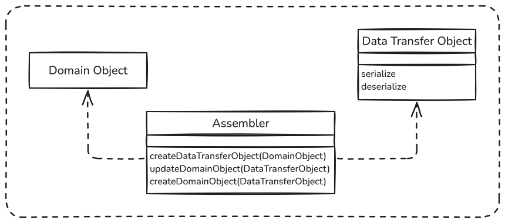
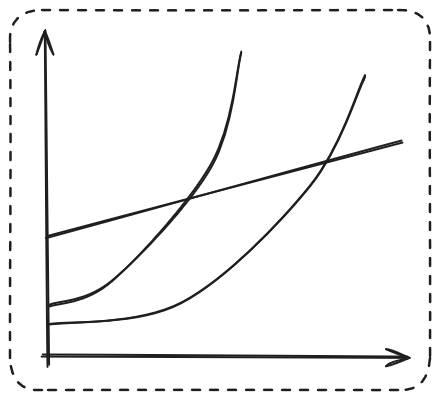
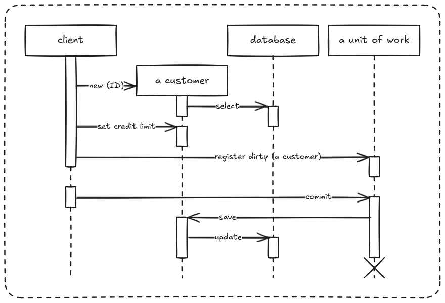

# Desenvolvimento de Aplicações Empresariais

## Prova Escrita 1 - 2017/18

**1.** Considere o seguinte trecho de texto, retirado do livro de texto da UC:

“[...] é um entendimento comum do desenho do sistema por parte dos developers do projeto. Este entendimento comum é normalmente expresso através dos componentes principais do sistema e da forma como interagem. Também reflete decisões, que muitas vezes os developers desejariam tê-las acertado mais cedo, pois são de difícil alteração mais tarde[...]”.

**a)** A que se refere propriamente este trecho de texto? Justifique.

**b)** Dê exemplos concretos para as seguintes frases:

**i.** “Este entendimento comum é normalmente expresso através dos componentes principais do sistema e da forma como interagem”;

**ii.** “Também reflete decisões, que muitas vezes os developers desejariam tê-las acertado mais cedo, pois são de difícil alteração mais tarde[...]”

**2.** Dê exemplos de duas aplicações que, embora possam ser consideradas empresariais, apresentam pelo menos duas características distintas de aplicações empresariais. Identifique essas características para cada uma dessas aplicações.

**3.** Considere a seguinte frase:

"A camada de acesso a dados é onde estão os componentes que acedem às bases de dados relacionais.”

O que é que não está totalmente correto nesta frase? Justifique, dando um exemplo concreto.

## Prova Escrita 2 - 2017/18

**1.** Suponha que está a desenvolver uma aplicação empresarial que utiliza o padrão arquitetural das 3 camadas. Dê 2 exemplos concretos que indiquem que a camada de lógica de negócio **não está a ser bem implementada**, no que à modularidade e separação de responsabilidades concerne.

**2.** Na sua aplicação empresarial, um dos objetivos seria manter o modelo de domínio completamente independente dos componentes de acesso a dados, i.e., sem qualquer referência das classes do modelo de domínio para esses componentes. Que padrão utilizaria? Exemplifique.

**3.** O seu modelo de domínio é composto por várias hierarquias de classes. Que estratégia de mapeamento dessas hierarquias para o modelo de dados (tabelas da Base de Dados) escolheria? Justifique.

**4.** De que vantagens poderia usufruir ao implementar o padrão Two Step View na sua aplicação empresarial? Exemplifique.

**5.** Para que servem as interfaces locais e as interfaces remotas numa aplicação empresarial? Exemplifique.

## Prova Escrita 2 - 2021/22

**6.** Considere as seguinte descrições de lock modes existentes no Java EE:

**5.** Descreva duas situações concretas em que seria claramente vantajoso optar-se pela utilização do padrão Table Module em vez do padrão Domain Model.

**6.** Dê um exemplo de uma aplicação web onde seria mais difícil de se implementar um Front Controller.

**7.** Suponha que a sua empresa se tem deparado com problemas de concorrência na utilização de uma aplicação empresarial.

Escreva 5 questões/perguntas que faria numa reunião com os **developers** e demais decisores da empresa, para ajudar a decidir qual a melhor solução para esses problemas.

**8.** Não sendo possível terem-se todos os componentes de uma aplicação empresarial num mesmo ambiente de execução/hardware, identifique, através de um esquema, as estratégias de distribuição mais comuns destes componentes, que se adotam para estas aplicações.

**9.** Considere a seguinte Figura:



**a)** Qual o principal propósito do componente Assembler, nesta Figura? Exemplifique.

**b)** Explique, com um exemplo, como poderia este Assembler ser utilizado em conjunto com uma Remote Facade.

## Prova Escrita 1 - 2022/23

**1.** Considerando os conceitos de arquitetura de software e de aplicação empresarial, comente a seguinte frase: "Uma aplicação empresarial com uma arquitetura de software baseada em micro-serviços é muito melhor do que uma outra aplicação empresarial com uma arquitetura de software baseada em camadas".

**2.** Porque razões compensa investir tempo e dinheiro (em análise, desenho e desenvolvimento de software) para definir e implementar uma arquitetura de software adequada a determinada aplicação empresarial? Exemplifique.

**3.** Como poderia definir e afinar uma estratégia de Lazy/Eager Loading da sua aplicação empresarial, por forma a minimizar o impacto que os carregamentos de dados desnecessários teriam no seu desempenho global? Justifique, dando exemplos concretos.

**4.** Descreva com um exemplo concreto (usando texto, diagramas, esquemas de tabelas) a diferença entre as estratégias de mapeamento de heranças conhecidas como Class Table Inheritance e Concrete Table Inheritance.

**5.** Considere o seguinte trecho de código Java.

```java
public class Pessoa {
  ...
  public Money calculaRetornoIRS() {...}

  public Money calculaRendimentosColeta() {...}

  public boolean isMarcadoParaAuditoriaAT() {...}

  private final static String findStatementString = "SELECT id, nome_proprio, apelido, numero_dependentes FROM pessoas WHERE id = ?";
  public static Pessoa find(Long id) {
    // código de ligação a BD e execução da query findStatementString
    // devolução do resultado da query
  }

  public static Pessoa load(ResultSet rs) throws SQLException {
    // código carregamento das strings de rs num novo objeto da classe Pessoa
  }

  private final static String updateStatementString = "UPDATE pessoas SET nome_proprio = ?, apelido = ?, numero_dependentes = ? WHERE id = ?";
  public void update() {
    // código de ligação à BD e execução da query updateStatementString
  }

  private final static String insertStatementString = "INSERT INTO pessoas VALUES (?, ?, ?, ?)";
  public Long insert() {
    // código de ligação à BD e execução da query insertStatementString
  }
...
}
```

**a)** Que padrão está a ser representado por este trecho de código Java? Justifique;

**b)** Que outros padrões arquiteturais de acesso a dados conhece, e que favoreçam a separação de operações de lógica de negócio das operações de acesso a dados? Exemplifique com esquemas representativos desses padrões.

## Prova Escrita 2 - 2022/23

**6.** Que principais diferenças existem entre uma Service Layer thin (magra) e uma Service Layer thick (gorda)? Justifique, descrevendo com exemplos as principais funções de cada uma destas variantes de Service Layer.

**7.** Dê um exemplo de uma utilização concreta do padrão Two Step Transform View.

**8.** Relativamente a concorrência em aplicações empresariais:

**a)** Explique, com exemplos, as soluções que existem para resolver problemas de concorrência, mas que não envolvam a utilização de estratégias/padrões de locking;

**b)** A estratégia de pessimistic locking previne a ocorrência de erros de corretidão, mas não permite concorrência, na sua forma original. Como se pode afiná-la, para que passe a haver a possibilidade de acesso concorrencial? Exemplifique.

**9.** Descreva 4 razões pelas quais, muitas vezes em aplicações empresariais, não é possível terem-se todos os componentes num mesmo ambiente de execução/hardware. Complemente a sua resposta com exemplos de estratégias de distribuição mais comuns destes componentes.

## Prova Escrita 1 - 2023/24

**1.** Enuncie 3 características de aplicações empresariais à sua escolha, e descreva que influência pode ter cada uma delas na definição/adoção de uma arquitetura de software. Exemplifique.

**2.** No padrão arquitetural das 3 camadas, enuncie 3 responsabilidades dos componentes da camada de lógica de apresentação, e dê um exemplo prático para cada uma delas.

**3.** Indique como funciona o padrão Data Mapper, e dê exemplos de 2 vantagens em relação ao padrão Table Data Gateway.

**4.** Tendo acesso às estatísticas de operação de uma base de dados de uma aplicação empresarial, identificou-se um número muito grande de acessos (tanto de leitura como de escrita), bem como uma média bastante alta de volume de dados por cada acesso de leitura. Que soluções sugeriria para otimizar estes acessos? Exemplifique.

**5.** Considere os seguintes trechos de código Java EE:

```java
@Entity
@Inheritance(strategy = InheritanceType.JOINED) // Concrete Table Inheritance
@DiscriminatorColumn(name = "TIPO_COLAB")
public class Colaborador {
    @Id
    @GeneratedValue
    private long id;
    private String nome;

    // . . .
}

@Entity
@DiscriminatorValue("I")
@Table(name = "COLAB_TEMPO_INTEGRAL")
public class ColaboradorTempoIntegral extends Colaborador {
    private int salario;

    // . . .
}

@Entity
@DiscriminatorValue("P")
@Table(name = "COLAB_PART_TIME")
public class ColaboradorPartTime extends Colaborador {
    private int valorHora;

    // . . .
}
```

**a)** Indique as tabelas e respetivas colunas que este código Java EE originaria numa base de dados relacional;

**b)** Complete os trechos de código Java EE com os elementos mínimos previstos para o tipo de componentes Java EE apresentado.

## Normal - 2023/24

### Parte 1

**1.** Dê um exemplo de uma aplicação empresarial à sua escolha, e descreva 3 características que a fazem ser uma aplicação empresarial.

**2.** Descreva com exemplos 2 situações que motivaram o aparecimento de aplicações empresariais desenvolvidas em 3 camadas.

**3.** Indique 2 razões pelas quais a utilização do padrão Data Mapper se tornou generalizada no desenvolvimento de aplicações empresariais. Exemplifique.

**4.** No desenvolvimento de um Content Management System (tipo WordPress) para um blog, existe uma Classe Conteúdo que é herdada pelas classes Artigo, Video e Imagem. Há muitos mais atributos comuns que específicos destas 3 subclasses, e pode haver necessidade de fazer queries polimórficas (e.g., últimos 10 conteúdos publicados). Quer-se também o máximo de simplicidade na base de dados, reduzir operações de join e ter uma indexação consistente de conteúdos, independentemente do seu tipo. Qual a estratégia de mapeamento de heranças ORM que recomendaria neste caso? Justifique.

**5.** Considere o seguinte log, aquando da execução de uma aplicação Jakarta EE com JPA:

```text
Exception in thread "main" org.hibernate.LazyInitializationException: failed to lazily initialize a collection of role: com.logicbig.example.Person.phoneList, could not initialize proxy - no Session at org.hibernate.collection.internal.AbstractPersistentCollection.throwLazyInitializationException (AbstractPersistentCollection.java:582) at org.hibernate.collection.internal.AbstractPersistentCollection.withTemporarySessionIfNeeded(AbstractPersistentCollection.java:201) at  org.hibernate.collection.internal.AbstractPersistentCollection.initialize (AbstractPersistentCollection.java:561) at org.hibernate.collection.internal.AbstractPersistentCollection.read(AbstractPersistentCollection.java:132) at org.hibernate.collection.internal.PersistentBag.iterator(PersistentBag.java:277) at java.lang.Iterable.forEach(Iterable.java:74) at com.logicbig.example.ExampleMain.main(ExampleMain.java:17)
```

**a)** Descreva uma possível razão para o surgimento desta exceção, relacionando-a com um padrão de acesso a dados/ORM;

**b)** Descreva 2 formas distintas de corrigir esta exceção, e justifique aquela que utilizaria numa aplicação empresarial.

### Parte 2

**6.** O gráfico seguinte representa 3 opções de padrões de lógica de negócio, na relação entre o esforço de melhorar uma aplicação empresarial e a complexidade do seu domínio.



**a)** Complete o gráfico, copiando-o para a sua folha de prova e legendando-o com toda a informação em falta;

**b)** Descreva com exemplos 3 conclusões que se podem retirar do gráfico.

**7.** Para desenvolver uma aplicação web "cliente" para uma plataforma digital do tipo e- commerce loja virtual, por que tipo de Controller optaria para controlar a lógica de apresentação? Justifique, dando exemplos que reforcem a sua escolha.

**8.** Considere o seguinte trecho de código Jakarta EE:

```java
//...
try {
    entityManager.getTransaction().begin();
    Lugar lugarReservado = entityManager.find(Lugar.class, lugarId, LockModeType.PESSIMISTIC_WRITE);
    lugarReservado.setEstado(ReservaEstado.RESERVADO);
    entityManager.getTransaction().commit();
} catch (Exception e) {
    entityManager.getTransaction().rollback();
} finally {
    entityManager.close();
}
// ...
```

**a)** Explique o mecanismo de controlo de concorrência exemplificado neste trecho de código;

**b)** Para o exemplo em questão, o que poderia acontecer caso não houvesse controlo de concorrência? Justifique.

**9.** Descreva 2 cenários distintos onde a utilização de um Assembler de Data Transfer Objects (DTOS) representa uma clara vantagem. Justifique.

## Recurso - 2022/23

**1.** Identifique 4 consequências que poderá ter um processo de definição de uma arquitetura de software deficiente, para uma aplicação empresarial. Exemplifique.

**2.** No padrão arquitetural das 3 camadas, as validações de dados e de ações variam consoante os componentes de cada uma das camadas. Dê 3 exemplos de validação, uma por cada tipo de componentes deste padrão.

**3.** Exemplifique, para cada um dos padrões Lazy Load, Identity Map e Unit of Work, um benefício que a sua correta implementação poderá trazer a uma aplicação empresarial.

**4.** Considere os resultados dos comandos **SHOW TABLES** e **SHOW COLUMNS** executados em um terminal de banco de dados, referentes às listagens de tabelas e atributos, conforme definidos pela estratégia de mapeamento de herança em Java EE:

```sql
SHOW TABLES;
```

| Tabela        | Schema |
| ------------- | ------ |
| EMPLOYEE      | PUBLIC |
| FULL_TIME_EMP | PUBLIC |
| PART_TIME_EMP | PUBLIC |

```sql
SHOW COLUMNS FROM EMPLOYEE;
```

| Coluna   | Tipo         | Null | Chave | Default |
| -------- | ------------ | ---- | ----- | ------- |
| EMP_TYPE | VARCHAR(31)  | NO   |       | NULL    |
| ID       | BIGINT(19)   | NO   | PRI   | NULL    |
| NAME     | VARCHAR(255) | YES  |       | NULL    |

```sql
SHOW COLUMNS FROM FULL_TIME_EMP;
```

| Coluna | Tipo        | Null | Chave | Default |
| ------ | ----------- | ---- | ----- | ------- |
| SALARY | INTEGER(10) | NO   |       | NULL    |
| ID     | BIGINT(19)  | NO   | PRI   | NULL    |

```sql
SHOW COLUMNS FROM PART_TIME_EMP;
```

| Coluna     | Tipo        | Null | Chave | Default |
| ---------- | ----------- | ---- | ----- | ------- |
| HOURLYRATE | INTEGER(10) | NO   |       | NULL    |
| ID         | BIGINT(19)  | NO   | PRI   | NULL    |

**a)** O que pode concluir acerca da estratégia de mapeamento de heranças adotada para este caso? Justifique;

**b)** Escreva código Java EE das JPA Entities que poderão estar associadas a estas tabelas.

**5.** Indique, com exemplos, 2 razões pelas quais se poderá optar por Table Modules, para a implementação da lógica de negócio de uma aplicação empresarial.

**6.** Dê um exemplo concreto de um cenário de utilização onde seria mais aconselhável optar-se por uma estratégia de locking otimista para controlar a concorrência numa aplicação empresarial.

**7.** Muitas vezes, uma aplicação empresarial tem de suportar várias aplicações "cliente” (web, mobileAndroid_v1, mobileAndroid_v2, mobileiOS_v1, mobileiOS_v2, CLI), cada uma necessitando de versões distintas de Data Transfer Objects (DTOs).

Como se poderá garantir, ao mesmo tempo, a evolução da lógica de negócio da aplicação empresarial, a compatibilidade com aplicações cliente mais antigas e respetivos DTOs, e o surgimento de novas aplicações cliente no futuro? Exemplifique.

## Perguntas Soltas

**4.** Como é que se podem resolver problemas de concorrência, sem aplicar estratégias de locking? Exemplifique;

---

**6.** A sua empresa pediu-lhe que implementasse rapidamente uma aplicação empresarial baseada numa base de dados já existente, e cujos componentes do modelo de domínio permitissem igualmente operações CRUD de registos dessa base de dados.

**a)** Qual o padrão que melhor se adequaria a estes requisitos? Justifique;

**b)** Que desvantagens relativas a esta escolha poderiam surgir no futuro? Justifique.

---

**3.** Observe o seguinte trecho de código em Java:

```java
class A {
  // ...
  public void commit() {
    insertNew();
    updateDirty();
    deleteRemoved();
  }
  // ...
}
```

**a)** A que padrão de acesso a dados pode estar associado este trecho de código? Justifique, relacionando o código representado ao funcionamento geral deste padrão.

**b)** Dê um exemplo concreto da utilização deste padrão em conjunto com o padrão Identity Map.

---

**b)** Porque é que não se devem ter queries SQL hardcoded em componentes da 2.a camada? Exemplifique.

---

**4.** Considere o seguinte trecho de código Java:

```java
class Supplier...
  public List getProducts() {
    if (products == null)
      products = Product.findForSupplier(getID());
    return products;
  }
  // ...
```

**a)** A que padrão e respetiva variante pode corresponder este trecho de código? Justifique;

---

Conside a seguinte figura:



**a)** Identifique o nome do padrão a que se refere, bem como a sua variante representada;

**b)** Desenhe um diagrama de sequência UML idêntico ao da Figura apresentada, para uma outra variante deste padrão.

---

**2.** Enuncie e exemplifique uma vantagem e uma desvantagem do padrão Table Data Gateway em relação ao padrão Active Record.
